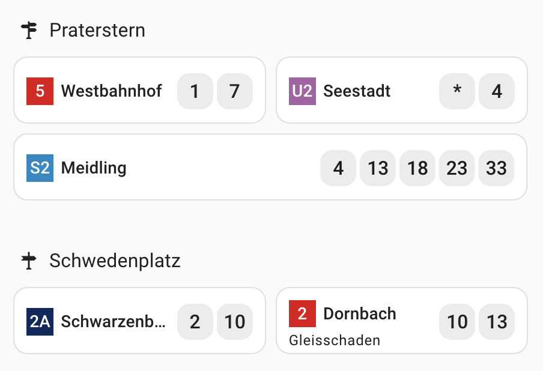
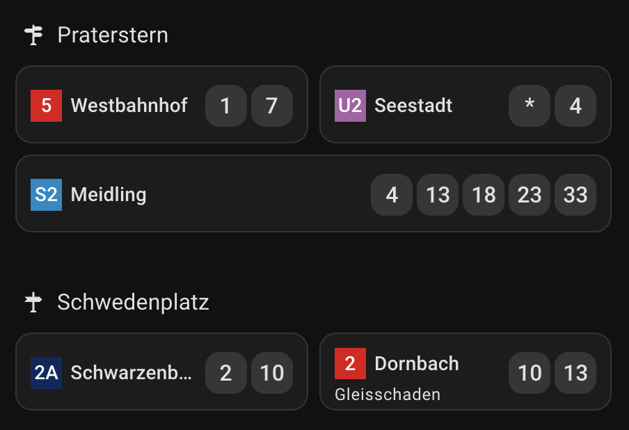

# Wiener Linien HA-Dashboard

A minimalistic real-time public transport dashboard for Vienna's public transport system (Wiener Linien) integrated with Home Assistant. Monitor departure times for trains, trams, buses, and metro lines with service disturbance warnings and intelligent data fetching.

## Screenshots

### Light Theme


### Dark Theme  


## Features

- **Real-time departure monitoring** for all Vienna public transport services (U-Bahn, S-Bahn, Trams, Buses)
- **Customizable departure count** - Configure how many next departures should be visible for the card
- **Service disturbance alerts** - Displays traffic jam information, warning texts, and real-time destination mismatch warnings  
- **Smart API rate limiting** - Queries all stations with a single API request and caches data in HA for unlimited concurrent devices and stations while respecting Wiener Linien API limits
- **Intelligent data management** - Only fetches data when dashboard is visible and stop when no one is viewing
- **Server-side processing** - All API calls and data processing happen on the server, ensuring maximum performance even on old upcycled tablets used for dashboard viewing
- **Customizable styling** - Line-specific colors and theming
- **Multiple departures** - Shows next two departure times
- **Responsive design** - Works on desktop and mobile devices

## Components

- **Custom Lovelace Card** (`monitor-card.js`) - Displays departure information
- **NodeRED Flow** (`NodeRED-Flow.json`) - Handles API calls and data processing
- **Home Assistant Integration** - Uses input_text helpers for data storage

## Prerequisites

- Home Assistant instance
- NodeRED

## Setup

### 1. Find Station and Line IDs

Find the `lineId` and `stopId` for your desired stations:

- **Via [mabe.at Helper App](https://till.mabe.at/rbl/)**: Shows StopId as "RBL/StopID" and LineId in URL
  - Example: Line 5 (lineId: 105), Stop Praterstern (stopId: 345) 
  - URL: https://till.mabe.at/rbl/?line=105&station=9095
- **Via [Wiener Linien Open Data](https://www.data.gv.at/katalog/dataset/wiener-linien-echtzeitdaten-via-datendrehscheibe-wien#resources)**

> **Note:** The same station (e.g., Praterstern) has multiple different stop IDs depending on the line.

### 2. Configure Home Assistant Helper Variables

Add `input_text` helper variables to your Home Assistant via `configuration.yaml` or the GUI. Use the format: `monitor_STOPID_LINEID_DIRECTION`

The direction parameter filters departures by destination. Use only the starting characters (no spaces, dashes, or special characters).

```yaml
input_text:
  monitor_345_105_westbahnhof: # Line 5 (lineId: 105), Stop Praterstern (stopId: 345), Direction: Westbahnhof
    max: 255
  monitor_4263_302_seestadt: # Line U2 (lineId: 302), Stop Praterstern (stopId: 4263), Direction: Seestadt
    max: 255
  # Add more as needed...
```

### 3. Setup NodeRED Flow

1. **Create Long Lived Access Token**:
   - Go to your Home Assistant [user profile](https://www.home-assistant.io/docs/authentication/)
   - Generate a new Long Lived Access Token

2. **Install Home Assistant NodeRED Integration**:
   ```bash
   npm install node-red-contrib-home-assistant-websocket
   ```
   Or install via [NodeRED Palette Manager](https://nodered.org/docs/user-guide/runtime/adding-nodes): `node-red-contrib-home-assistant-websocket`

3. **Configure Home Assistant Connection**:
   - Drag any Home Assistant node to the workspace
   - Double-click to insert Home Assistant URL and access token
   - Test the connection

4. **Import the Flow**:
   - Import NodeRED-Flow.json [Importing Flows - Node-RED Documentation](https://nodered.org/docs/user-guide/editor/workspace/import-export)
   - Deploy it

### 4. Install Custom Lovelace Card

Add the custom card to your Home Assistant resources ([Documentation](https://developers.home-assistant.io/docs/frontend/custom-ui/registering-resources/)):

1. Copy `monitor-card.js` to your `www` folder in Home Assistant Config folder
2. Add the resource in your Lovelace configuration:

```yaml
resources:
  - url: /local/monitor-card.js
    type: module
```

Or via UI: Settings → Dashboards → 3 dots → Resources → Add Resource

### 5. Configure Dashboard Cards

Add cards to your Lovelace dashboard for each monitored station:

1. Edit Dashboard → Add Card → Manual
2. Use the following configuration:

```yaml
type: custom:monitor-card
entity: input_text.monitor_345_105_westbahnhof
title: Westbahnhof
line: "5"
color: "#c00a09"
publish_visibility: true  # Required for at least one card to enable intelligent data fetching
max_departures: 2
```

## Configuration Options

### Card Configuration

| Parameter | Type | Required | Description |
|-----------|------|----------|-------------|
| `entity` | string | Yes | The input_text helper entity ID |
| `title` | string | Yes | Display name for the destination |
| `line` | string | Yes | Line number/name to display |
| `color` | string | No | Background color for the line badge |
| `publish_visibility` | boolean | No | Enable visibility tracking (set to `true` for exactly one card) |
| `max_departures` | integer | No | Number of visible departure times (default: 2) |

### Max Departure Limit

As default, the number of visible departure times, `max_departures`, is limited to 7. This is the configured number of forwarded datapoints from the NodeRED backend to the frontend to keep the transfer data structure under the HA limit of 255-characters (see below). To increase this, only increase the constant `maxDepartures = 7` at the beginning of the `Process` node from the NodeRED flow.

### Wiener Linien Colors

| Mode             | 🎨                                             | Hex Code   |
|------------------|-----------------------------------------------------------|------------|
| **Bus**          |  | `#0b295d` |
| **Tram**         |  | `#c00a09` |
| **S-Bahn**       |  | `#0089c4` |
| **Regional Train**|  | `#e2002a` |
| **U1**           |  | `#e3000f` |
| **U2**           |  | `#a862a4` |
| **U3**           |  | `#db7607` |
| **U4**           |  | `#01963e` |
| **U5**           |  | `#008f95` |
| **U6**           |  | `#9d6830` |


## How It Works

### NodeRED Flow Architecture


1. **Visibility Tracking**: Card with visibility tracking reports when it becomes visible/hidden
2. **Smart Data Fetching**: API calls only occur when someone is viewing the dashboard, with an automatic viewer removal after 5 minutes
3. **Automatic data invalidation**: All real-time data is automatically invalidated after a maximum of 60 seconds to prevent displaying old data.
4. **Rate Limiting**: Prevents excessive API requests (30-second intervals)
5. **Home Assistant Integration**: Updates input_text entities with departure times

### Disturbance warning texts

- If no real-time data is available for a specific train, its departure minute counter time is underlined
- Since disturbances are reported by the API for specific trains, these are prefixed with a number to relate to the first or second train, e.g. "1. Stau, 2. Stau"
- If a specific train is not going to the intended line destination, the new destination is displayed with a prefixed arrow, e.g. "1. -> Wexstrasse"

### Internal Data Format

The card displays departure data in this minimal format to stay under the 255-character limit of the variable values of the different Home-Assistant APIs:
```json
{
  "d": [1,5,11,...], // Departure times in minutes
  "r": [1,1,0,...] // Departure is realtime (1) or scheduled (0)
  "t": "Gleisschaden"  // Optional warning text
}
```